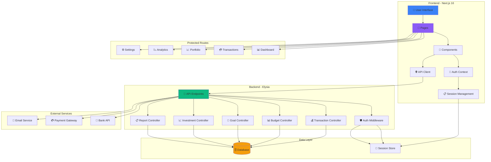
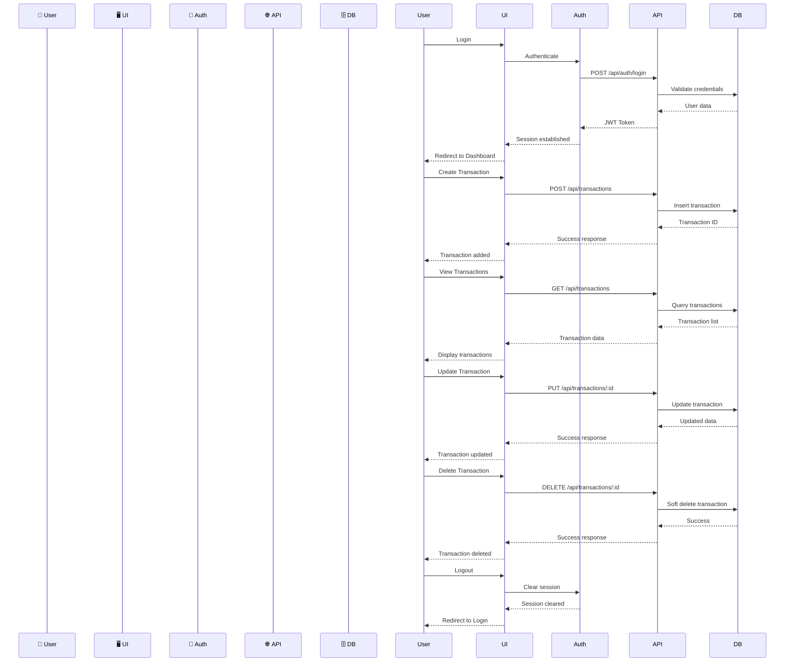
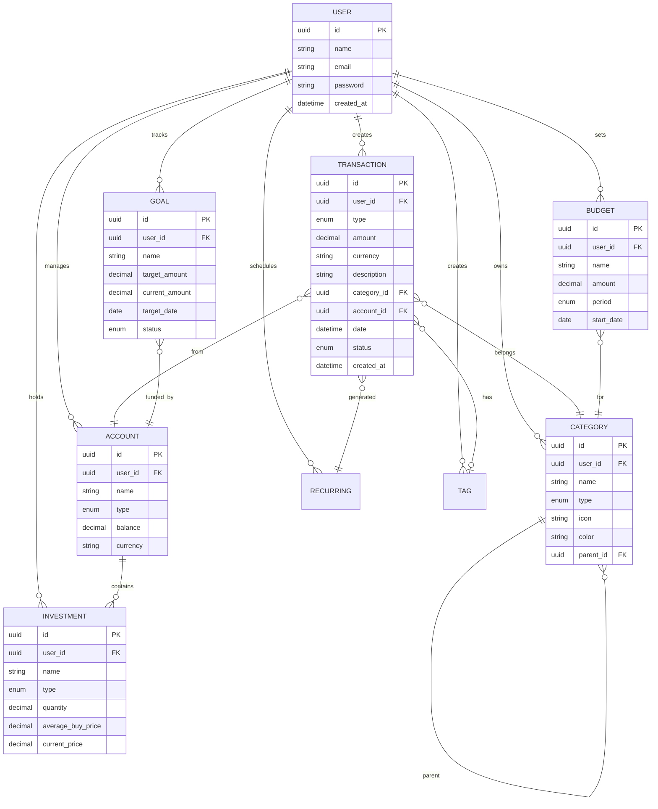

# 💰 NovaFinance

<div align="center">


**A comprehensive financial management application built with Next.js 16**

[Features](#features) • [Architecture](#system-architecture) • [Getting Started](#getting-started) • [Documentation](#documentation)

</div>

---

## 📖 Overview

NovaFinance is a powerful financial management application that helps you track income, expenses, investments, and achieve your financial goals. Built with modern technologies including Next.js 16, TypeScript, and HeroUI, it provides a beautiful and intuitive user experience with advanced analytics and reporting capabilities.

## ✨ Features

### 🎯 Core Functionality

- **💳 Transaction Management**
  - Track income, expenses, and transfers with full CRUD operations
  - Full **TanStack Table v8** integration with multi-column sorting, search, pagination, and multi-condition filtering
  - Ergonomic transaction form (`/transactions/new`) with segmented type controls, quick nominal increments (+50k, +100k, reset), and category auto-creation presets
  - Multi-file drag-and-drop receipt/document upload with manual per-file AI extraction
  - Recurring transactions and status tracking
  - Export to PDF, CSV, Excel formats

- **🏦 Master Wallets & Accounts Management (`/wallets`)**
  - Full CRUD management of liquidity sources
  - Support for multiple account types: Bank, E-Wallet, Cash, Credit Card, and Investments
  - Color-coding, balance adjustments, and real-time aggregation

- **🌊 Interactive Money Flow Visualization (`/money-flow`)**
  - Sankey / topological flow diagram mapping cash inflows and outflows
  - Visual trace: Income Sources ➔ Liquidity Wallets ➔ Expense Categories
  - Dynamic nodes and link summaries

- **🎯 Financial Goals & Wishlist (`/goals`)**
  - Track target milestones, deadlines, and current progress
  - Real-time progress bars and remaining duration metrics
  - Integrated AI Feasibility Assessment & Action Plan recommendations

- **📊 Modernized Interactive Dashboard**
  - Dedicated **QuickActionBar** for rapid navigation to all key workflows
  - Full-width **CashflowChart** with 6 scale options: 1 Day, 1 Week, 1 Month, 1 Year, 5 Years, and Custom ranges
  - High-polish **ExpenseBreakdown** category cards with distribution percentages
  - Interactive **AssetBreakdown** featuring 3 view modes (Donut chart, Bar chart, Detailed list), asset category filter pills, and liquidity stats

- **🤖 Multi-Provider AI Engine (`/settings` & `/api/ai/*`)**
  - Centralized primary provider selection in `/settings`:
    - **Google Gemini**: `gemini-1.5-flash`, `gemini-1.5-pro`, `gemini-2.0-flash`
    - **Groq**: `llama-3.3-70b-versatile`, `mixtral-8x7b-32768`
    - **DeepSeek**: `deepseek-chat`, `deepseek-coder`
    - **Anthropic Claude**: `claude-3-5-sonnet`, `claude-3-haiku`
  - Per-feature secondary fallback overrides for 4 intelligent features:
    1. Transaction & Receipt OCR AI Extraction
    2. Financial Health Audit & Anomaly Detection
    3. Intelligent Cashflow & Spending Suggestions
    4. Goal Feasibility & Action Plan Predictor

- **📈 Wealth & Investment Portfolio (`/portfolio`)**
  - Global Market Indices Ticker supporting **IHSG (IDX Composite 🇮🇩)** as default, S&P 500, NASDAQ, Nikkei 225, Hang Seng, FTSE, DAX, Gold, Crypto
  - Executive KPI cards: Total Value, Modal Beli, Unrealized PnL (Rp & %), Annual Passive Income / Dividends, and Diversification Score (1-100)
  - Finviz / S&P-style interactive **Portfolio Heatmap & Treemap** with return-based color scaling
  - **Monte Carlo Wealth Projector** & Compound Interest forecasting (5 to 20 years, monthly DCA, expected CAGR)
  - Modern Portfolio Theory **Smart Rebalancing Engine** (Actual vs Target allocation with 1-click buy/sell advice)
  - **Dividend & Passive Income Calendar** with monthly payout distributions
  - Full **Holdings Table** with search, asset class filters, mini 7-day sparklines, and modal CRUD with ticker presets
  - Integrated **AI Portfolio Strategist** for risk analysis and tactical recommendations

- **📉 SaaS Financial Analytics & Intelligence (`/analytics`)**
  - **SaaS KPI Matrix**: Real-time Total Revenue / Inflow, Operating Expenses (OPEX), Net Operating Cashflow (Free Cashflow Margin), and Liquid Cash Reserve Runway (Burn Rate Simulator)
  - **Interactive Visualizations (Recharts v3)**: Inflow vs Outflow monthly comparative bar chart, cumulative capital accumulation trend area chart, and donut expense distribution
  - **Ranked Category Intelligence**: Top OPEX categories with interactive percentage progress meters and nominal breakdown
  - **Executive Report Generation**:
    - **Multi-Sheet Excel (.xlsx)**: Executive KPI summary sheet + complete transaction audit ledger
    - **Branded Executive PDF (.pdf)**: High-resolution printable financial statement with KPI cards, color-coded badges, and categorized breakdown
  - **Nova AI Financial Advisor & Conclusion**:
    - Automatic financial health score (0-100) and status diagnosis (Sehat, Cukup Baik, Perlu Perhatian, Kritis)
    - Key observation insights (Positive, Warning, Info) and strategic CFO recommendations checklist
    - Interactive **Tanya Nova AI** question prompt bar with pre-configured quick prompt chips (e.g. burn rate safety, cost cutting, 3-month projection)

- **🏦 Multi-Account Support**
  - Manage multiple account types (bank, cash, credit cards, crypto, loans)
  - Multi-currency support with auto-conversion
  - Account balance history tracking
  - Bank synchronization via API (Planned)
  - Account transfer between accounts
  - Account grouping and organization
  - Credit card payment tracking

- **🔄 Recurring Transactions**
  - Automate recurring income and expenses
  - Flexible scheduling (daily, weekly, monthly, yearly)
  - Smart reminders before due dates
  - Skip occurrence option
  - Variable amount support
  - Recurring transaction templates
  - Auto-creation of transactions

- **🏷️ Category Management**
  - Custom categories with unlimited hierarchy
  - Category icons and colors
  - Default categories for new users
  - Category usage analytics
  - AI-powered category suggestions
  - Bulk category reassignment
  - Category-based spending analysis

- **🏷️ Tags System**
  - Flexible organization with custom tags
  - Tag colors and icons
  - Tag-based filtering and search
  - Bulk tag assignment
  - Tag groups
  - Tag usage statistics

### 🎨 User Experience

- **🖥️ Modern UI**
  - Beautiful gradient-based design
  - HeroUI component library
  - Smooth animations and transitions
  - Intuitive navigation with sidebar
  - Clean and organized layout

- **📱 Responsive Design**
  - Works seamlessly on desktop, tablet, and mobile
  - Mobile-optimized interface
  - Touch-friendly controls
  - Adaptive layouts

- **🌙 Dark Mode**
  - Full dark mode support
  - Automatic theme switching
  - Custom theme preferences
  - Eye-friendly color schemes

- **⚡ Real-time Updates**
  - Instant data synchronization
  - Live balance updates
  - Real-time chart rendering
  - WebSocket support (Planned)

- **📤 Export/Import**
  - Export data to CSV, PDF, Excel
  - Import from bank statements
  - Backup and restore functionality
  - Data migration tools

## 🛠️ Tech Stack

### Frontend

- **⚛️ Framework**: Next.js 16 (App Router)
  - Server Components and Server Actions
  - Route Groups for protected routes
  - Streaming and Suspense
  - Image optimization

- **📘 Language**: TypeScript 5.0
  - Strict type checking
  - Path aliases (@/*)
  - Interface definitions

- **🎨 UI Library**: HeroUI (@heroui/react)
  - Beautiful pre-built components
  - Dark mode support
  - Customizable themes
  - Accessibility features

- **💅 Styling**: Tailwind CSS 3.0
  - Utility-first CSS
  - Custom gradients
  - Responsive design
  - Dark mode variants

- **📊 Charts**: Recharts
  - Interactive charts
  - Responsive visualization
  - Custom tooltips
  - Animation support

- **🎯 Icons**: Lucide React
  - Consistent icon set
  - Tree-shakeable
  - Customizable size and color

- **🌗 Theme**: next-themes
  - System theme detection
  - Theme persistence
  - Smooth transitions

### Backend

- **🚀 Runtime**: Bun
  - Fast JavaScript runtime
  - Native TypeScript support
  - Built-in bundler

- **⚡ Framework**: Elysia
  - Fast HTTP framework
  - Type-safe routing
  - Schema validation
  - Plugin system

- **🔐 Authentication**: Supabase Auth (Planned)
  - Built-in authentication
  - OAuth providers (Google, GitHub, etc.)
  - Session management
  - Role-based access control (RBAC)
  - Password hashing with bcrypt

- **🗄️ Database**: Supabase (PostgreSQL)
  - Built-in Auth
  - Real-time subscriptions
  - File storage for receipts
  - Row Level Security (RLS)
  - Auto-scaling
  - Alternative: NeonDB (Serverless PostgreSQL)

### Development

- **📦 Package Manager**: Bun
  - Fast dependency installation
  - Native TypeScript support efficient

- **🔍 Linting**: ESLint
  - Code quality checks
  - Auto-fixing
  - Custom rules

- **🐳 Containerization**: Docker + Podman
  - Consistent environments
  - Easy deployment
  - Multi-stage builds

### Integrations

- **📷 OCR (Receipt Scanning)**
  - Library: tesseract.js (v7.0.0)
  - Browser-based OCR
  - Receipt parsing
  - Invoice digitization
  - Camera capture support
  - Alternative: TabScanner API, Google Gemini Vision

- **🤖 MCP (Model Context Protocol)**
  - Library: @modelcontextprotocol/sdk (v2)
  - AI-powered financial advisor
  - Automated categorization
  - Spending insights
  - Integration with Claude/GPT
  - Tools and resources for LLM context

- **💬 Natural Language Processing**
  - Library: compromise
  - Parse natural language transactions
  - Voice input support
  - Entity extraction
  - Quick transaction entry

- **🌐 Hosting**
  - Platform: Vercel
  - Database: Supabase (PostgreSQL)
  - Alternative: NeonDB
  - Edge functions support
  - Global CDN

## 🏗️ System Architecture

### Architecture Overview

The application follows a modern client-server architecture with clear separation of concerns:



### Data Flow

1. **User Interaction**: User interacts with the UI components
2. **Authentication**: AuthContext manages session state and authentication
3. **API Calls**: API Client communicates with backend endpoints
4. **Data Processing**: Controllers process business logic
5. **Data Storage**: Data is persisted in the database
6. **External Integration**: External services are called when needed

## 🔄 CRUD Flow Diagram

### Authentication & Transaction Flow

This diagram shows the complete flow from user login to CRUD operations:



### Flow Explanation

1. **Authentication Flow**
   - User submits credentials through login form
   - AuthContext validates with backend API
   - Backend checks database for user
   - JWT token generated and stored
   - Session established and user redirected

2. **Create Transaction**
   - User fills transaction form
   - API validates and inserts into database
   - Transaction ID returned
   - UI updates with success message

3. **Read Transactions**
   - User requests transaction list
   - API queries database with filters
   - Results returned and displayed
   - Pagination for large datasets

4. **Update Transaction**
   - User edits transaction details
   - API updates database record
   - Changes reflected immediately
   - Audit log updated

5. **Delete Transaction**
   - User requests deletion
   - Soft delete performed (not permanent)
   - Can be restored within grace period
   - Hard delete after retention period

6. **Logout**
   - User clicks logout
   - Session cleared from context
   - Token invalidated
   - Redirected to login page

## 🗂️ Entity Relationship Diagram

### Database Schema

This diagram shows the relationships between all entities in the system:



### Entity Descriptions

- **👤 USER**: User account with authentication credentials
- **💳 TRANSACTION**: Financial transactions (income, expense, transfer)
- **🏷️ CATEGORY**: Transaction categories with hierarchy support
- **🏦 ACCOUNT**: Financial accounts (bank, cash, credit, crypto)
- **📊 BUDGET**: Budget limits for spending control
- **🎯 GOAL**: Financial goals with progress tracking
- **📈 INVESTMENT**: Investment holdings and performance
- **🔄 RECURRING**: Recurring transaction schedules
- **🏷️ TAG**: Flexible tags for organization

## Getting Started

### Prerequisites
- Node.js 18+ or Bun
- Docker/Podman (for containerization)

### Installation

1. Clone the repository:
```bash
git clone https://github.com/yourusername/novajournal.git
cd novajournal/novajournal-fe
```

2. Install dependencies:
```bash
bun install
# or
npm install
```

3. Set up environment variables:
```bash
cp .env.example .env
```

4. Run the development server:
```bash
bun dev
# or
npm run dev
```

5. Open [http://localhost:3000](http://localhost:3000) with your browser.

### Backend Setup

1. Navigate to backend directory:
```bash
cd ../novajournal-be
```

2. Install dependencies:
```bash
bun install
```

3. Run the backend server:
```bash
bun run src/index.ts
```

The backend will be available at [http://localhost:8080](http://localhost:8080).

## Dummy Accounts

For testing purposes, use these dummy accounts:

- **User**: `user@example.com` / `password123`
- **Admin**: `admin@example.com` / `admin123`

## Documentation

- [Changelog](./docs/CHANGELOG.md) - Track all changes and updates
- [CRUD Concept](./docs/CRUD_CONCEPT.md) - Detailed CRUD operations and API design
- [API Documentation](./docs/API.md) - Complete API reference (coming soon)
- [Deployment Guide](./docs/DEPLOYMENT.md) - Deployment instructions (coming soon)

## Project Structure

```
novajournal-fe/
├── app/                      # Next.js 16 app router directory
│   ├── (protected)/         # Protected route group
│   │   ├── components/       # Shared layout components (Sidebar, Navbar with status & role badges)
│   │   ├── dashboard/       # Dashboard (QuickActionBar, CashflowChart, AssetBreakdown, ExpenseBreakdown)
│   │   ├── transactions/    # Transactions list (TanStack Table) & /new form
│   │   ├── wallets/         # Wallets & Accounts Master Management
│   │   ├── money-flow/      # Money Flow topological visualizer
│   │   ├── goals/           # Financial Goals & Wishlist with AI Feasibility
│   │   ├── portfolio/       # Portfolio page
│   │   ├── analytics/       # Analytics page
│   │   └── settings/        # Centralized Multi-Provider AI config & user settings
│   ├── api/ai/              # Next.js API Routes for AI (parse, audit, suggestion, goal-feasibility)
│   ├── login/               # Login page
│   ├── register/            # Registration page
│   ├── forgot-password/     # Forgot password page
│   └── page.tsx             # Landing / Home page
├── contexts/                # React contexts (AuthContext, etc.)
├── lib/                     # Utility libraries (api.ts, ai-config.ts, queries.ts)
└── public/                  # PWA manifest, service worker & static assets
```

## Contributing

Contributions are welcome! Please read our contributing guidelines before submitting PRs.

## License

This project is licensed under the MIT License.

## Support

For support, email support@novajournal.com or open an issue on GitHub.
